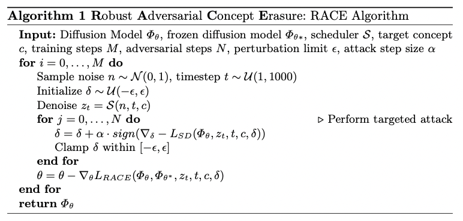

# R.A.C.E.: Robust Adversarial Concept Erasure for Secure Text-to-Image Diffusion Model
 

In the evolving landscape of text-to-image (T2I) diffusion models, the remarkable capability to generate high-quality images from textual descriptions faces challenges with the potential misuse of reproducing sensitive content. To address this critical issue, we introduce Robust Adversarial Concept Erase (RACE), a novel approach designed to mitigate these risks by enhancing the robustness of concept erasure method for T2I models. RACE utilizes a sophisticated adversarial training framework to identify and mitigate adversarial text embeddings, significantly reducing the Attack Success Rate (ASR). Impressively, RACE achieves a 30\% reduction in ASR for the ``nudity'' concept against the leading white-box attack method. Our extensive evaluations demonstrate RACE's effectiveness in defending against both white-box and black-box attacks, marking a significant advancement in protecting T2I diffusion models from generating inappropriate or misleading imagery. 
This work underlines the essential need for proactive defense measures in adapting to the rapidly advancing field of adversarial challenges.

## Training Configuration 
Our framework builds upon the [Erasing Concepts from Diffusion Models](https://github.com/rohitgandikota/erasing) project. For initial setup and training configuration, kindly refer to the provided link.

## Guide for Adversarial Training
The main code for adversarial training can be found in /train-scripts/train-esd.py.

To engage in adversarial training following the initial model setup with ESD, please integrate the following parameters:
* `iteration` - specifies the number of iterations for 
* `adv_train` - a flag to activate adversarial training mode.
* `exp_name` - designates the name of the experiment.
* `pretrained_esd`- specifies the path to the pre-trained ESD model weights.
* `epsilon` - defines the magnitude of the epsilon ball.
* `pgd_num_step` - sets the number of steps for the adversarial attack process.
* `lasso` - a flag for the regularization method discussed in the Discussion section.

Please note the necessity to adjust the default values in the argument parser.

Adversarial training aims to eliminate undesirable visual concepts from pre-trained diffusion model weights by solely utilizing a brief textual description of the targeted concept for guidance. The R.A.C.E. model undergoes fine-tuning based on a modified version of ESD's loss function, detailed in Section 3. This approach autonomously identifies adversarial samples and excludes them from the model's knowledge base without relying on external datasets like prompts or images.

Below, the algorithm outlines the methodology employed in our adversarial training process:

